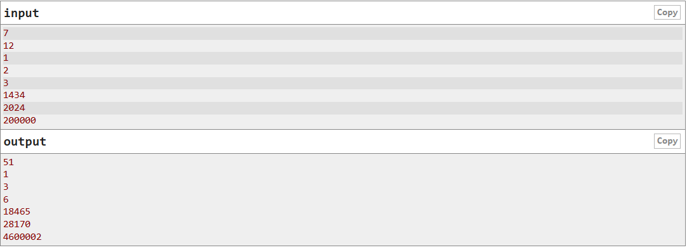

# C. Vlad and a sum of sum of digits
Third Evidence for the Subject of Computational Implementation. For this evidence, a problem in CodeForces was chosen so that the Paradigm can be implemented.

The problem C. Vlad and a sum of sum of digits, is a Code Forces problem. The problem is a about a man Vladislav wrote the integers from 1 to n and replaced each integer with the sum of its digits. What is the final sum of the board now?

If n = 12, then the list of integers would be like this: <br>
`1 2 3 4 5 6 7 8 9 10 11 12`
And the final list applying Vlad's Rules would be like this: <br>
`1 2 3 4 5 6 7 8 9 1 2 3` <br>
As you can see the digits from 1 to 9 is the same digit as `0 + 1` is 1 or `0 + 2` is 2. But when you have a two digit number like 12 `1 + 2` is 3 or 11 `1 + 1` is 2.  Niw that you have the final list, you need to have the sum of all the digits, meaning that `1+2+3+4+5+6+7+8+9+1+2+3=51`, so the final output is 51. In order to give more complexity to the problem, I decided to add a merge sort. In order to order the list from the smallest to the biggest. 
Based on this, the platform has given mi a series of outputs and inputs that I should consider in order to help him, diffirenciate between female and male.


Link to the problem: https://codeforces.com/problemset/problem/236/A

## Understanding the problem
In order to help our character Vlad, we need to understand that only the integers with two digits are the only ones that can change. So we need to think about, how can we get the final integer in order to get the sum of a two digit number.

If you add the residual and cuotient of a number n divided by ten. Then you get the sum of a two digit number. For example:
- 13: 13%10 is 3 and 13/10 is 1. So the final answer `1 + 3 = 4`. 
- 12: 12%10 is 2 and 12/10 is 1. So the final answer is `1 + 2 = 3`
- 10: 10%10 is 0 and 12/10 is 1. So the final answer is `1 + 0 = 0`

Have this formula in mind, as we are going to use it later on the paradigm, to solve the problem.


## Curiosity
I chose this problem, because I thought it would be interesting to understand how to use the lambda calculus combining the strings. The complexity of the code is on making the list of the string unique. That is why I chose this problem. I also wanted to implement by myself a merge sort

# Functional Paradigm
## Context
A functional paradigm is the one that encourages program development to be used purely using functions and mathematical processes. To understand functional paradigm we need to talk about Lambda calculus, it was developed by Alonso Church, it gives us a theorical model that describe functions and their evaluations.

### Pure Functions
The objective of having pure functions, reads as follow:
- They allways produce the same output for the same arguments.
- They do not modify any arguments ot global/logical variables, the only impotant thing here is the output that it gives.

This helps us have a more clean and steady code, they are also easy to debug because they have no hidden inputs or outputs.

### Recursion
In functional languages there are no "for" or "while" loops. This is implemented through recursion, which are the ones that call themselves until a base case is achieved.

### Referential Transparency
Once a variable is defined, they cannot change their value through out the program, so if you want to store a variable we have to define new variables. Ths eliminates any case of side effects because any variable can be replaced with its actual value

### Variables are Immutable
In a functional program we cannot modify a variable after it has been initialized. We can reate new variables, but not change them. Some advatages are what it follows:
- Pure functions are easier to understand because they don’t change any states and depend on the input. Whatever output they produce is the return value they give. 
- Because functions are used as variables, then this makes the code more readable and easier to process.
- Testing and debugging is easier: beacause functions take only aguments and produce an output.
- It avoids repeated code: because functions are only used when necessary, it avoids using useless code.

## The model diagram
For the visual implementation of how my code works, I did a diagram explaining how was the thought process of my code:


In this diagram you a see how the functions process the information so that we can get to our final result.

## Models
As we have talked before. Functional Paradigm is based on functions and the lambda calculus. In order to get the solution of the problem I created different functions that would help us. 

For the first function that I implemented, is a function that changes the two digit number to the one digit number that we want in our list. In order to do this, we neeed to have in mind this formula: `(n%10) + (n/10)`. Have this in mid as this is implemented in the function.

``` racket
; Hacemos una funcion para los digitos que tienen dos numeros como 11, 12, 14, 20, 30

(define double-digits
  ;we recieve the integer
  (lambda (n)
    (cond
      ; base case
      ; when the integer is equal to cero
      [(= n 0) 0]
      [else
       ; formula applied to get the sum of the two digits
       (+ (modulo n 10)
          (double-digits (quotient n 10)))])))
```

The second function that I implemented, is a fuinction that makes the list from 1 to n. As the first input only gives us an integer n. In here another integer is used to replace the integers that are of two digits and give them this new value.
``` racket
; Funcion para crear la lista
(define create-list
  ;Usamos un contator para ir agregando numeros a la lista
  ;Verificar que hemos llegado a los numeros que queremos
  (lambda (n counter my-list)
    (cond
      ;Caso base
      ;cuando el contador es mayor que n
      ; significa que ya tenemos todos nuestros numeros en la lista
      [(> counter n) my-list]
      [else
       (create-list n
                    (+ counter 1)
                    (cons (double-digits counter) my-list))])))
```

Now that we have our principal functions, I implemented several other functions. To order our final list, from smaller to bigger number. The functions that I implemented are the following:
``` racket
; Merge Sort para ordenar la lista
; Funcion para unir las dos listas ya ordenadas
(define merge
  (lambda (l1 l2)
    (cond
      [(null? l1) l2]
      [(null? l2) l1]
      ; Si primer elemento de l1 es menor
      ; toma el valor de la lista 1
      [(< (car l1) (car l2))
       (cons (car l1) (merge (cdr l1) l2))]
      [else
       ; toma la lista 2
       (cons (car l2) (merge (cdr l2) l1))])))

; Obtenemos los numeros en posiciones impares 
(define split-odd
  (lambda (l)
    (cond
      [(null? l) '()]
      ; Si hay un elemento regresa ese elemento
      [(null? (cdr l)) l]
      [else
       ; Toma el primer elemento de la lista
       (cons (car l) (split-odd (cdr (cdr l))))])))

; Ordenamos la lista con los numeros de la lista pares
(define split-even
  (lambda (l)
    (cond
      [(null? l) '()]
      [(null? (cdr l)) '()]
      [else
       ; Tomas el segundo elemento, hay saltos de dos en dos
       (cons (car (cdr l)) (split-even (cdr (cdr l))))])))

; Funcion que ordena la lista
(define merge-sort
  (lambda (l)
    (cond
      [(null? l) l]
      [(null? (cdr l)) l]
      [else
       ; Se unen las dos mitades
       (merge
        ; Se ordena posiciones impares
        (merge-sort (split-odd l))
        ; Se ordena en posiciones pares 
        (merge-sort (split-even l)))])))
```

How it was implemented, is that the list is divided in two. The numbers with an odd index integer and the numbers with an even index integer. Both lists are then ordered from smallest to biggest number and finally they are both combined to get one final list.

Then we have a function where the final sum of the each element of the list is added, in order to get the final number that we are looking for. 

```racket
; Suma todos los elementos de la lista
; Vamos sumano elementos de la lista
; Hasta dejarla vacia 
(define suma-lista
  (lambda (my-list)
    (cond
    ; base case
      [(empty? my-list) 0]
      [else
       (+ (first my-list)
          (suma-lista (rest my-list)))])))
```

Finally I implemented a function, where the function is called and in here you call the builidng list function, that helps us to create the list. The different functions are called like the merge function to order the list, and the final function, that sums each element is aldo called.

``` racket
;Funcion principal donde llamamos todo
; Suma la lista ordenada 
(define vlad-sum
  (lambda (n)
    (suma-lista (merge-sort (create-list n 1 '())))))

```

## Tests

For the tests, I put different integers, with different lengths, I divided the tests into two, the first one are the test cases with their respective number.

```Racket
;; Casos de prueba
(define caso_1  12)
(define caso_2  1)
(define caso_3  5)
(define caso_4  9)
(define caso_5  200000)
(define caso_6 1434)
(define caso_7 2024)
(define caso_8 300000)
```


## Analysis
### Time Complexity
The program has a complexity of O(n^2), this is due to the last function, implementing multiple functions concatenated to get the final result. Processing each of the elements but for every element member is called. Making the functon a two operation part, so this makes the complexity of the problem O(n^2)

### Another Paradigm
Another paradigm implemented is the logical one, using Prolog. In here it is implemented similarly as in racket except that a path is more clearly seen here. Some of the reasons why the functional paradigm is better than logical paradigm in this case:
- Clarity of intent: In racket, the solution comes like a series of steps: eliminate duplicates, count and check list. In Prolog this is implemented as logical clauses and relies in unification, but this makes the solution more complex than needed
- Determinism: Prorlog's solution is based on goal solution and can explore multiple paths. But in this case there is only one solution per problem or input. Rcket's purely functionality makes it very straight forward and single response.
- No side effects: the Prolog's solution requires a negation "/+" which makes the solution prooedual when it is purely semantic. Raacket's member and cond makes it cleaner.

### Other Solution
As told before the other solution is using logical paradigm, with prolog and eventhough the racket solution is better. Prolog it's not a bad idea to be used to solve the problem.

### Reference
http://theswissbay.ch/pdf/Gentoomen%20Library/Programming/Functional%20Programming/Functional%20Programming%20For%20The%20Real%20World.pdf


